# Manual de usuario — Smart-Claims Agent

**Seguros Pepín, S.A. — MVP agéntico de gestión de siniestros**  
TFM Máster en Machine Learning e Inteligencia Artificial, OBS Business School

---

## Índice

1. [Introducción y público objetivo](#1-introducción-y-público-objetivo)
2. [Requisitos previos](#2-requisitos-previos)
3. [Configuración del entorno](#3-configuración-del-entorno)
4. [Modo 1 — Docker Compose (backend, base de datos y RAG)](#4-modo-1--docker-compose-backend-base-de-datos-y-rag)
5. [Modo 2 — App Streamlit (demo principal)](#5-modo-2--app-streamlit-demo-principal)
6. [Modo 3 — CLI de demostración, API REST y evaluador](#6-modo-3--cli-de-demostración-api-rest-y-evaluador)
7. [Interpretación de resultados](#7-interpretación-de-resultados)
8. [Inspección de la base de datos con Adminer](#8-inspección-de-la-base-de-datos-con-adminer)
9. [Resolución de problemas frecuentes](#9-resolución-de-problemas-frecuentes)
10. [Referencias](#10-referencias)

---

## 1. Introducción y público objetivo

Este manual describe el modo de operación del prototipo **Smart-Claims Agent** en su versión de entrega del TFM (estado del repositorio a 18 de agosto de 2026). No es un manual orientado al empleado final de Seguros Pepín, S.A., sino un **manual operativo para el evaluador técnico** (director del TFM, tribunal académico o desarrollador que revise el prototipo). Su objetivo es permitir reproducir, inspeccionar y validar el comportamiento del sistema de forma autónoma.

El sistema puede operarse de tres formas complementarias:

- **Modo 1 — Docker Compose:** levanta el backend FastAPI junto con la infraestructura de datos (MariaDB, ChromaDB y Adminer) en contenedores aislados, con persistencia real en base de datos. Es la vía para usar la API REST y auditar las decisiones en SQL.
- **Modo 2 — App Streamlit (la demo principal):** interfaz web autónoma que invoca el grafo de agentes directamente en el mismo proceso Python, sin necesidad de Docker ni de MariaDB. Es la modalidad desplegada en Streamlit Community Cloud y la recomendada para la demostración en vivo ante el tribunal. Incluye siete vistas: Inicio, Bandeja, Nueva reclamación, Conciliación (Agente F), Historial, Arquitectura y Caso libre.
- **Modo 3 — CLI de demostración, API REST y evaluador:** la CLI ejecuta cuatro casos predefinidos desde línea de comandos y muestra el Chain of Thought; la API REST acepta peticiones HTTP desde curl, Postman o cualquier cliente; el evaluador in-process reproduce las métricas del capítulo 4 sobre el dataset sintético.

> **Nota sobre integraciones externas:** todas las herramientas que en producción consultarían sistemas reales de Seguros Pepín (gestor documental, núcleo de pólizas, sistemas de pago, listas oficiales de sanciones) están implementadas como **mocks deterministas**, ya que el proyecto académico no tiene acceso a esos sistemas. En cambio, las **capacidades de IA del proyecto sí son reales**: la extracción multimodal (Agente C, Claude Vision), el RAG de cobertura (Agente D, ChromaDB) y el motor antifraude (Agente G) operan de verdad, **sobre datos sintéticos** (pólizas, lista OFAC y baselines de prototipo). El LLM Claude de Anthropic es **opcional**: si se proporciona `ANTHROPIC_API_KEY`, cada agente genera razonamientos Chain of Thought con `claude-sonnet-4-6` y el Agente C realiza extracción multimodal real; sin clave, el sistema usa un *fallback* determinista y la demo decide de forma idéntica.

> **Sobre las capturas de pantalla:** todas las figuras de este capítulo se han generado sobre la app Streamlit ejecutada en local (Streamlit 1.57.0, Python 3.11) con la clave de Anthropic configurada, de modo que muestran el modo «Claude activo». Sin clave, la disposición de las pantallas es idéntica; solo cambian el texto del razonamiento y la sección de extracción multimodal (véase §3.3).

---

## 2. Requisitos previos

### 2.1 Modo 1 — Docker Compose

| Requisito | Versión mínima | Notas |
|---|---|---|
| Docker Engine | 24.x | Incluye el demonio de contenedores |
| Docker Compose | v2 (plugin integrado) | Comando `docker compose` sin guion |
| RAM disponible | 4 GB | Para los cuatro servicios en paralelo |
| Puertos libres | 8000, 8080, 8082, 3306 | Véase tabla de servicios en §4.2 |

Verificación rápida:

```bash
docker --version
docker compose version
```

### 2.2 Modo 2 — App Streamlit (local) y Modo 3 — CLI

| Requisito | Versión | Notas |
|---|---|---|
| Python | 3.11 | Versión fijada en `.python-version` (`3.11.16`), que es la que usa Streamlit Community Cloud; 3.12 también es compatible |
| Dependencias (raíz) | — | `requirements.txt` de la raíz del repositorio (Streamlit 1.57.0, LangGraph 1.2.1, langchain-anthropic 1.4.3, chromadb 1.5.9, pandas 2.2.3) |
| Dependencias (backend) | — | `backend/requirements.txt` (para la CLI, los tests y la API sin Docker) |
| Navegador | Reciente | Chrome, Edge o Firefox actualizados |
| Conexión a internet | Opcional | Solo si se configura `ANTHROPIC_API_KEY` (llamadas a la API de Anthropic) |

Instalación de dependencias (una sola vez):

```powershell
# Windows — desde la raíz del repositorio
py -m pip install -r requirements.txt
```

```bash
# Linux / macOS
python3.11 -m pip install -r requirements.txt
```

---

## 3. Configuración del entorno

### 3.1 Crear el fichero `.env`

El fichero `.env` es la fuente de configuración del sistema. Se parte de la plantilla incluida en el repositorio:

```bash
# Bash (Linux / macOS)
cp .env.example .env
```

```powershell
# PowerShell (Windows)
Copy-Item .env.example .env
```

### 3.2 Variables de entorno relevantes

Editar `.env` con los valores adecuados. La tabla siguiente describe las variables más importantes tal como aparecen en `.env.example`:

| Variable | Valor por defecto en `.env.example` | Descripción |
|---|---|---|
| `ANTHROPIC_API_KEY` | `sk-ant-api03-XXXX...` (placeholder) | Clave API de Anthropic. **Opcional** — véase §3.3 |
| `HITL_AMOUNT_THRESHOLD` | `5000.0` | Umbral (€) por encima del cual se activa la revisión humana (HITL) |
| `SCA_RAG_ENABLED` | `1` | `1` = el Agente D usa RAG real sobre ChromaDB; vacío o `0` = catálogo determinista |
| `DB_USER` | `claims_user` | Usuario de aplicación de MariaDB |
| `DB_PASSWORD` | `claims_s3cret_dev` | Contraseña del usuario de aplicación |
| `DB_HOST` | `mariadb` | Hostname del servicio MariaDB (nombre del contenedor en Docker) |
| `DB_PORT` | `3306` | Puerto de MariaDB |
| `DB_NAME` | `smart_claims` | Nombre de la base de datos |
| `DB_ROOT_PASSWORD` | `root_s3cret_dev` | Contraseña root de MariaDB |
| `CHROMA_HOST` | `chromadb` | Hostname del servicio ChromaDB |
| `CHROMA_PORT` | `8000` | Puerto interno de ChromaDB |
| `CHROMA_COLLECTION` | `pepin_policies` | Colección vectorial con las pólizas de Seguros Pepín |
| `BACKEND_URL` | `http://backend:8000` | URL interna del backend (entre contenedores Docker) |
| `ENVIRONMENT` | `development` | Entorno de ejecución |
| `LOG_LEVEL` | `INFO` | Nivel de log del backend |

> **Nota sobre moneda:** los importes se expresan en euros (€) como simplificación del prototipo; en una implantación para Seguros Pepín se localizarían a pesos dominicanos (DOP / RD$). La app Streamlit muestra los importes con separador de millares anglosajón (`5,000 €`), por el formato numérico por defecto de Python.

### 3.3 La clave `ANTHROPIC_API_KEY` y el modo fallback

Esta variable controla el nivel de inteligencia real del sistema:

- **Con clave válida:** cada agente llama a `claude-sonnet-4-6` (temperatura 0, tiempo máximo de 20 s por llamada) para generar el razonamiento Chain of Thought. El Agente C realiza extracción multimodal real (tipo, importe, fecha, proveedor, resumen y confianza) sobre los documentos subidos mediante Claude Vision. Requiere conexión a internet y saldo en la cuenta de Anthropic. Un expediente completo tarda entre 20 y 60 segundos.
- **Sin clave (o clave vacía):** el módulo de razonamiento detecta la ausencia de la variable y retorna texto de fallback predefinido. **La decisión final del orquestador es idéntica en ambos modos**, ya que la lógica de enrutamiento es determinista (basada en validación de entrada, documentos aportados, fraude, cobertura e importe). Un expediente se resuelve en menos de un segundo. Para la evaluación académica del prototipo, el modo fallback es suficiente.

La app Streamlit muestra en la parte inferior de la barra lateral el indicador de modo activo:

- `🟢 Claude activo (CoT enriquecido)` — con clave.
- `⚪ Modo fallback determinista (sin clave)` — sin clave.

> En Streamlit Community Cloud, la clave se inyecta vía la sección *Secrets* del panel de administración de la app (véase `docs/DEPLOY-STREAMLIT.md`), nunca como variable de entorno del repositorio. El fichero `.streamlit/secrets.toml` está excluido del control de versiones por `.gitignore`.

### 3.4 Variable `SCA_RAG_ENABLED` y el Agente D

Cuando `SCA_RAG_ENABLED=1`, el Agente D (Verificación de cobertura) consulta una colección ChromaDB **embebida** (sin servidor: se indexan al arrancar los cuatro documentos de póliza sintéticos de `data/policies/SP-PCS-009-*.md`) para recuperar el fragmento de póliza más relevante según el tipo de siniestro. Si ChromaDB no está disponible o la variable está vacía/a `0`, el agente cae automáticamente al catálogo determinista sin interrumpir el flujo.

La app Streamlit activa `SCA_RAG_ENABLED=1` por defecto mediante `os.environ.setdefault("SCA_RAG_ENABLED", "1")` al arrancar, por lo que la demo funciona con RAG real sin ninguna configuración adicional.

---

## 4. Modo 1 — Docker Compose (backend, base de datos y RAG)

### 4.1 Arranque del sistema

Desde la **raíz del repositorio**, con el fichero `.env` configurado:

```bash
docker compose up -d --build
```

Docker Compose construye la imagen local del backend, descarga el resto de imágenes (`chromadb/chroma:0.5.3`, `mariadb:11.3`, `adminer:4.8.1`) y levanta los servicios en segundo plano. El primer arranque puede tardar entre 2 y 5 minutos.

Para seguir los logs del backend en tiempo real:

```bash
docker compose logs -f backend
```

### 4.2 Servicios y URLs

| Servicio | Contenedor | Puerto host | URL | Descripción |
|---|---|---|---|---|
| Backend FastAPI | `sca-backend` | 8000 | `http://localhost:8000` | API REST + orquestador LangGraph |
| ChromaDB | `sca-chromadb` | 8080 | `http://localhost:8080` | Vector store para RAG de pólizas |
| MariaDB | `sca-mariadb` | 3306 | `localhost:3306` | Persistencia relacional |
| Adminer | `sca-adminer` | 8082 | `http://localhost:8082` | Inspector web de la BD |

> **El servicio `frontend` está desactivado.** Desde el 18 de agosto de 2026 el bloque `frontend` de `docker-compose.yml` está comentado: el antiguo dashboard `frontend/app.py` (que consumía la API por HTTP) ha sido sustituido por la app autónoma `streamlit_app.py`, que se ejecuta por separado (§5) y no necesita Docker. Por tanto, `docker compose up` **no** publica nada en el puerto 8501.

> El contenedor `sca-backend` espera a que MariaDB supere su healthcheck antes de iniciarse (condición `service_healthy` en `docker-compose.yml`). Si el backend aparece como `restarting` en los primeros 30-60 segundos, es comportamiento normal.

### 4.3 Verificación del sistema

Verificar que el backend responde:

```bash
curl http://localhost:8000/health
```

Respuesta esperada:

```json
{"status": "ok", "version": "0.5.0"}
```

Consultar el estado de los seis agentes:

```bash
curl http://localhost:8000/api/v1/agents/status
```

Respuesta esperada (resumen):

```json
{
  "pattern": "Supervisor (Hub-and-Spoke) sobre LangGraph",
  "agent_count": 6,
  "agents": [
    {"id": "A", "name": "Orchestrator", "status": "operational"},
    {"id": "B", "name": "Document Validator", "status": "operational"},
    {"id": "C", "name": "Multimodal Extractor", "status": "operational"},
    {"id": "D", "name": "Coverage Checker", "status": "operational"},
    {"id": "E", "name": "Claim Resolver", "status": "operational"},
    {"id": "G", "name": "Fraud Compliance", "status": "operational"}
  ]
}
```

La documentación Swagger interactiva está disponible en `http://localhost:8000/docs`.

### 4.4 Parada del sistema

```bash
# Detener los contenedores (conserva los volúmenes de datos)
docker compose down

# Detener y eliminar también los volúmenes
docker compose down -v
```

---

## 5. Modo 2 — App Streamlit (demo principal)

La app `streamlit_app.py` es la interfaz de demostración del prototipo. Ejecuta el grafo de agentes **en el mismo proceso** (importa `process_claim` del orquestador), de modo que no necesita backend, MariaDB ni Docker. La persistencia en base de datos es *best-effort*: si no hay MariaDB, el orquestador registra un aviso en el log y el resultado se muestra igualmente.

### 5.1 Arranque

**En local**, desde la raíz del repositorio:

```powershell
# Windows
py -m streamlit run streamlit_app.py
```

```bash
# Linux / macOS
python3.11 -m streamlit run streamlit_app.py
```

Streamlit abre el navegador automáticamente en `http://localhost:8501`. Si el puerto está ocupado, añadir `--server.port 8600` (o cualquier otro).

**En Streamlit Community Cloud**, la app está desplegada desde el repositorio `FreeBarnOwl/smart-claims-agent-vfull` (rama `main`, fichero principal `streamlit_app.py`), con `ANTHROPIC_API_KEY` y `HITL_AMOUNT_THRESHOLD` definidos en *Secrets*. El procedimiento de despliegue y actualización está descrito en `docs/DEPLOY-STREAMLIT.md`. Las apps gratuitas de Streamlit Cloud se «duermen» tras varios días sin uso: la primera visita puede tardar 1-2 minutos en despertar la app.

El tema visual (fondo claro, azul corporativo) está fijado en `.streamlit/config.toml`, por lo que la app se ve igual con independencia del tema del navegador.

### 5.2 Estructura de la interfaz

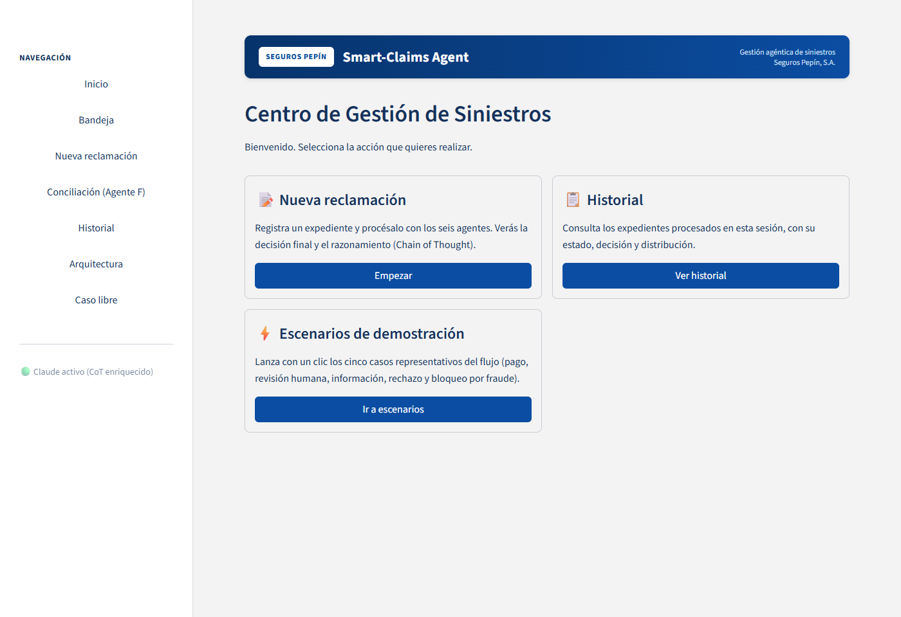

*Figura 3.1. Vista de Inicio. A la izquierda, la barra lateral de navegación con las siete vistas y el indicador de modo (Claude activo / fallback); a la derecha, la cabecera corporativa y las tarjetas de acceso rápido.*

La interfaz se compone de dos zonas fijas:

- **Barra lateral (izquierda):** sección *Navegación* con siete botones — `Inicio`, `Bandeja`, `Nueva reclamación`, `Conciliación (Agente F)`, `Historial`, `Arquitectura`, `Caso libre` — y, bajo el separador, el indicador de modo LLM (§3.3). El botón de la vista activa aparece resaltado.
- **Área principal:** cabecera «Seguros Pepín · Smart-Claims Agent» y el contenido de la vista seleccionada.

| Vista | Para qué sirve | Sección |
|---|---|---|
| Inicio | Menú de bienvenida con accesos rápidos a Nueva reclamación, Historial y Escenarios de demostración | §5.3 |
| Bandeja | Simula la bandeja de entrada de siniestros recibidos por WhatsApp, con adjuntos reales (fotos y factura PDF) que el Agente C lee con Claude Vision | §5.7 |
| Nueva reclamación | Cinco escenarios de un clic (uno por camino del flujo) y formulario personalizado con subida de documentos | §5.4 |
| Conciliación (Agente F) | Demostrador secundario del asesor de conciliación sobre tres expedientes en negociación | §5.8 |
| Historial | Tabla y gráfico de los expedientes procesados en la sesión | §5.9 |
| Arquitectura | Descripción de los seis agentes, del módulo aparte (Agente F) y de las características clave | §5.10 |
| Caso libre | Panel de reserva con campos de texto libre para probar el blindaje de entrada con datos improvisados | §5.11 |

> **El resultado no persiste al cambiar de vista.** Al pulsar cualquier botón de navegación se descarta el último resultado en pantalla (`last_result`); el expediente sigue disponible en *Historial*. Es un comportamiento deliberado para que ningún resultado antiguo se muestre por error en otra vista.

### 5.3 Vista Inicio

Tres tarjetas con botón: **Nueva reclamación** (`Empezar`), **Historial** (`Ver historial`) y **Escenarios de demostración** (`Ir a escenarios`, que lleva a la misma vista de Nueva reclamación). La tarjeta de *Arquitectura* está temporalmente oculta en Inicio; la vista sigue accesible desde la barra lateral.

### 5.4 Vista Nueva reclamación

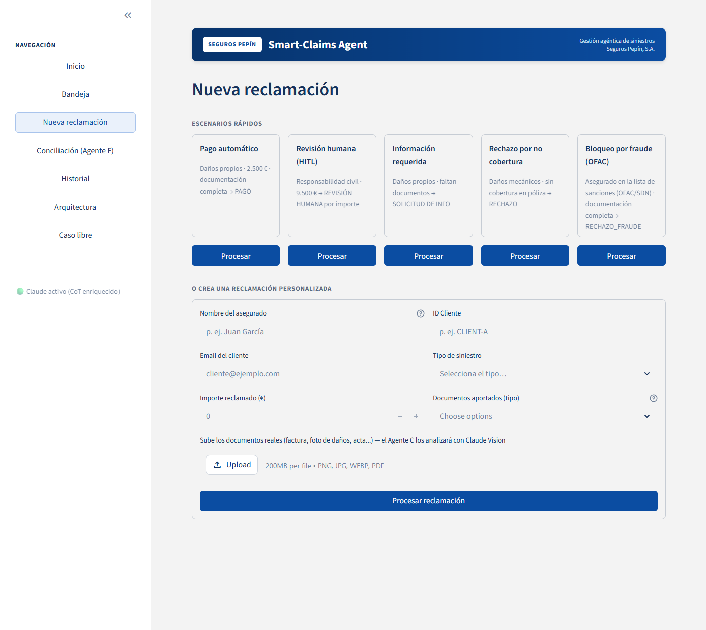

*Figura 3.2. Vista Nueva reclamación: cinco escenarios rápidos (arriba) y formulario personalizado, vacío por defecto (abajo).*

#### 5.4.1 Escenarios rápidos

Cinco tarjetas, una por cada camino posible del flujo. Pulsar `Procesar` bajo la tarjeta lanza el expediente con los datos indicados (cliente `CLIENT-DEMO`) y muestra el resultado bajo el formulario.

| Escenario | `claim_type` | Importe | Documentos | Nombre del asegurado | Decisión esperada |
|---|---|---|---|---|---|
| Pago automático | `danys_propis` | 2.500 € | `foto_danys`, `factura`, `denuncia_companyia` | — | `PAGO` (2.200 € pagados: 2.500 − 300 de franquicia) |
| Revisión humana (HITL) | `responsabilitat` | 9.500 € | `foto_danys`, `acta_policial`, `dades_tercer` | — | `REVISION_HUMANA` (9.500 € > umbral 5.000 €) |
| Información requerida | `danys_propis` | 3.000 € | Solo `factura` | — | `INFO_REQUERIDA` (faltan `foto_danys`, `denuncia_companyia`) |
| Rechazo por no cobertura | `danys_mecanics` | 1.500 € | `informe_taller`, `factura` | — | `RECHAZO` (exclusión SP-PCS-009 § 7.3) |
| Bloqueo por fraude (OFAC) | `danys_propis` | 2.500 € | Completos | `Viktor Nikolaev Kozlov` | `RECHAZO_FRAUDE` (coincidencia con la lista de sanciones sintética) |

#### 5.4.2 Formulario personalizado

Todos los campos arrancan **vacíos** (solo *placeholders*), de manera que el evaluador introduce exactamente lo que quiere probar:

| Campo | Tipo de control | Comportamiento |
|---|---|---|
| Nombre del asegurado | Texto (`p. ej. Juan García`) | Opcional. Se contrasta con la lista de sanciones (Agente G) |
| ID Cliente | Texto (`p. ej. CLIENT-A`) | Opcional; por defecto `CLIENT-A`. Los IDs `C-A`, `C-B` y `C-C` tienen historial simulado (§7.3) |
| Email del cliente | Texto | Opcional; por defecto `cliente@segurospepin.com` |
| Tipo de siniestro | Desplegable | Obligatorio. Cuatro tipos válidos (§5.4.3) |
| Importe reclamado (€) | Numérico, 0–100.000, paso 100 | Obligatorio (> 0). Para importes fuera de ese rango, usar *Caso libre* (§5.11) |
| Documentos aportados (tipo) | Selección múltiple | Tipos declarados del expediente; determinan `INFO_REQUERIDA` |
| Sube los documentos reales | Subida de ficheros (PNG, JPG, WEBP, PDF; hasta 200 MB/fichero) | Opcional. Si hay clave, el Agente C los analiza con Claude Vision |

Si se pulsa `Procesar reclamación` sin tipo o sin importe, la app muestra el aviso *«Indica al menos el tipo de siniestro y el importe reclamado.»* y no lanza el flujo.

> Los ficheros subidos se leen en memoria y se envían a Claude Vision en la misma petición; no se guardan en disco. Para una prueba rápida con documentos reales sin subir nada, la vista *Bandeja* (§5.7) ya incluye adjuntos.

#### 5.4.3 Tipos de siniestro y documentación requerida

El Agente B (validación documental) exige, por tipo, los siguientes documentos declarados. Cualquier ausencia produce `INFO_REQUERIDA` con la lista de los que faltan.

| `claim_type` | Etiqueta en la app | Documentos requeridos | Cobertura (Agente D, catálogo SP-PCS-009) |
|---|---|---|---|
| `danys_propis` | Daños propios | `foto_danys`, `factura`, `denuncia_companyia` | Cubierto · máx. 10.000 € · franquicia 300 € · § 3.2 |
| `responsabilitat` | Responsabilidad civil | `foto_danys`, `acta_policial`, `dades_tercer` | Cubierto · máx. 50.000 € · sin franquicia · § 4.1 |
| `robatori` | Robo | `acta_policial`, `llista_objectes_robats` | Cubierto · máx. 8.000 € · franquicia 500 € · § 5.0 |
| `danys_mecanics` | Daños mecánicos | `informe_taller`, `factura` | **No cubierto** · § 7.3 (exclusión) |

### 5.5 Lectura del resultado

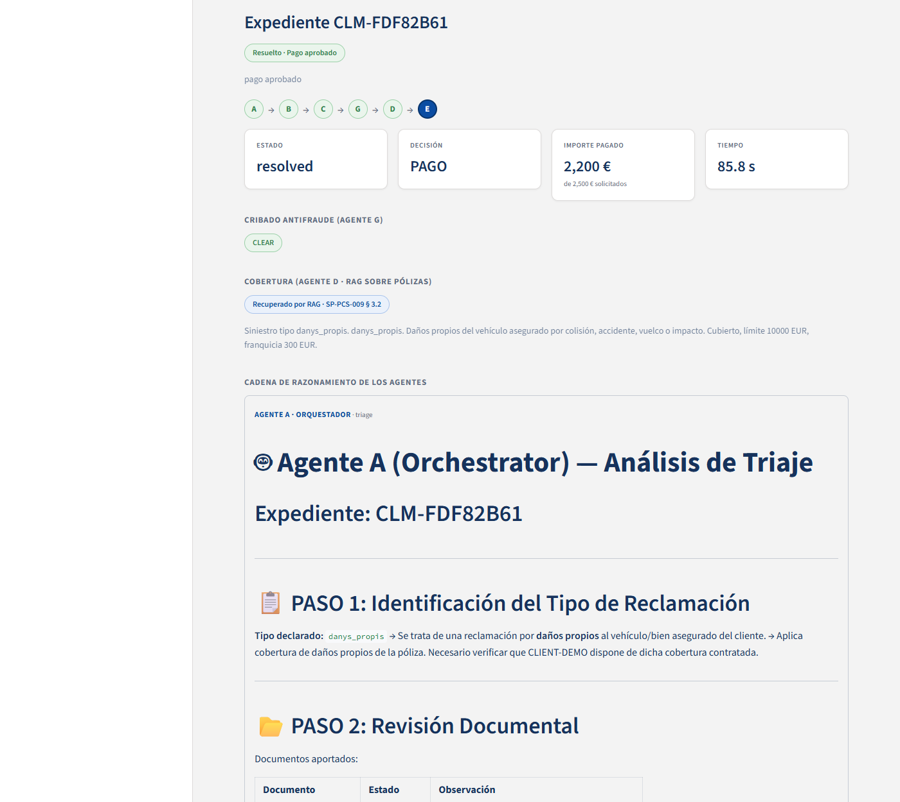

*Figura 3.3. Resultado del escenario «Pago automático»: cabecera con el número de expediente y la píldora de decisión, motivo de terminación, recorrido por los agentes (stepper), tarjetas de métricas, cribado antifraude, cobertura RAG y cadena de razonamiento.*

Todas las vistas que procesan expedientes (Nueva reclamación, Bandeja y Caso libre) muestran el resultado con la misma estructura, de arriba abajo:

1. **Cabecera `Expediente CLM-XXXXXXXX`** — identificador generado (8 caracteres hexadecimales) — y la **píldora de decisión**, con cinco posibles textos:

   | Píldora | Color | Código interno |
   |---|---|---|
   | `Resuelto · Pago aprobado` | Verde | `PAGO` |
   | `Revisión humana requerida` | Ámbar | `REVISION_HUMANA` |
   | `Información requerida` | Azul | `INFO_REQUERIDA` |
   | `Rechazado · Sin cobertura` | Rojo | `RECHAZO` |
   | `Bloqueado · Fraude / OFAC` | Rojo | `RECHAZO_FRAUDE` |

2. **Motivo de terminación** (texto pequeño bajo la cabecera): la razón literal con la que el orquestador cerró el expediente, por ejemplo `pago aprobado`, `importe 9500.0 EUR supera umbral HITL (5000.0 EUR)`, `documentacion incompleta: faltan foto_danys, denuncia_companyia`, `rechazado por no cobertura`, `caso bloqueado por fraude (veredicto: BLOCKED)` o `derivado a revision humana por alto riesgo de fraude (veredicto: HIGH_RISK)`.

3. **Recorrido por los agentes (stepper `A → B → C → G → D → E`):** cada agente que intervino aparece en verde, el último que actuó en azul y los no ejecutados en gris. Permite ver de un vistazo en qué punto terminó el flujo (§5.6).

4. **Cuatro tarjetas de métricas:** `Estado` (`resolved`, `pending_review`, `validating`, `rejected`), `Decisión` (código interno), `Importe pagado` (con el subtítulo «de N € solicitados») y `Tiempo` de procesamiento en segundos.

5. **Cribado antifraude (Agente G):** píldora con el veredicto (`CLEAR`, `MEDIUM_RISK`, `HIGH_RISK`, `BLOCKED`) y la puntuación de riesgo 0–1, más las señales detectadas (§7.3). Solo aparece si el flujo llegó al Agente G.

6. **Cobertura (Agente D · RAG sobre pólizas):** sección y fragmento de la póliza recuperados de ChromaDB, con la distancia de recuperación. Solo aparece cuando la fuente es `rag` (si el Agente D usó el catálogo determinista, se omite).

7. **Extracción multimodal real (Agente C · Claude Vision):** una tarjeta por documento subido con *Importe leído*, *Fecha*, *Confianza* (%) y resumen. Solo aparece si se subieron ficheros y hay clave de Anthropic (§7.5). Debajo se recuerda que el importe de la decisión es el declarado en el formulario, no el leído en el documento.

8. **Cadena de razonamiento de los agentes:** línea de tiempo con una tarjeta por agente (`decisions_log`), con su acción y el razonamiento Chain of Thought (generado por Claude o texto de fallback).

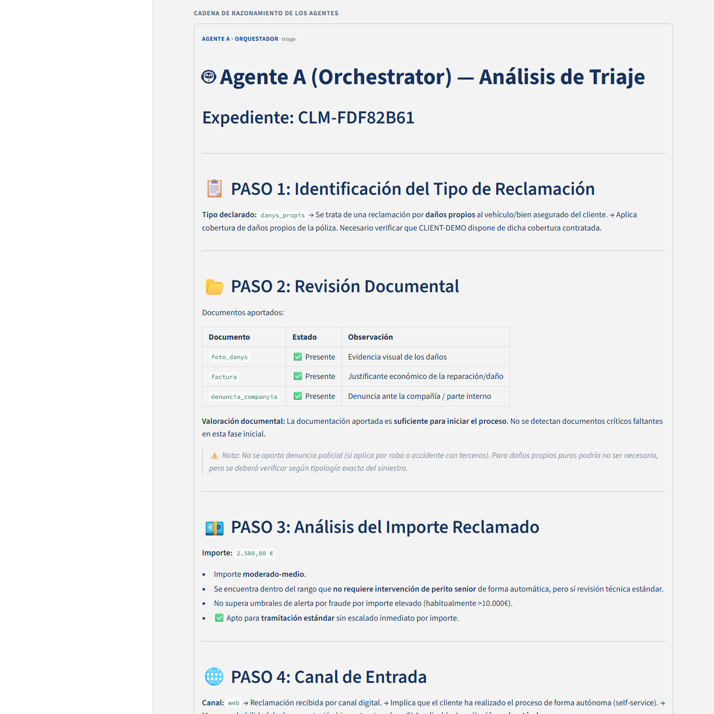

*Figura 3.14. Inicio de la cadena de razonamiento del escenario «Pago automático» con Claude activo: el Agente A documenta su triaje en seis pasos (tipo, documentación, importe, canal, señales de alerta y decisión) antes de ceder el control al Agente B. En modo fallback, cada tarjeta contiene una línea determinista equivalente a la de la CLI (§6.1).*

### 5.6 Los cinco caminos del flujo

El orquestador (Agente A) enruta cada expediente en este orden estricto: validación de entrada → B (documentos) → C (extracción) → G (fraude) → D (cobertura) → E (resolución). Cada camino termina en un punto distinto del stepper:

| Decisión | Agentes ejecutados | Dónde termina | Cómo dispararlo |
|---|---|---|---|
| `INFO_REQUERIDA` | A, B | El Agente B detecta documentos requeridos ausentes | Escenario «Información requerida» o cualquier tipo sin todos sus documentos |
| `RECHAZO_FRAUDE` | A, B, C, G | El Agente G devuelve `BLOCKED` (coincidencia OFAC confirmada) | Escenario «Bloqueo por fraude (OFAC)» o un nombre de asegurado parecido a una entrada de la lista de sanciones sintética (§7.3) |
| `REVISION_HUMANA` (por fraude) | A, B, C, G | El Agente G devuelve `HIGH_RISK` (score ≥ 0,55 sin OFAC) y deriva el expediente a revisión humana obligatoria | Acumular importe anómalo (+0,40) y duplicado reciente (+0,35) o incoherencias documentales (§7.3). Un importe anómalo por sí solo suma 0,40 y produce `MEDIUM_RISK`, que no corta el flujo |
| `RECHAZO` | A, B, C, G, D | El Agente D no encuentra cobertura | Escenario «Rechazo por no cobertura» o cualquier `danys_mecanics` |
| `REVISION_HUMANA` | A, B, C, G, D, E | El Agente E calcula un importe neto **superior** a 5.000 € | Escenario «Revisión humana», o `danys_propis` con importe > 5.300 €, o `responsabilitat` > 5.000 € |
| `PAGO` | A, B, C, G, D, E | El Agente E aprueba el pago (importe neto ≤ 5.000 €) | Escenario «Pago automático» o cualquier caso cubierto, documentado, sin fraude y por debajo del umbral |

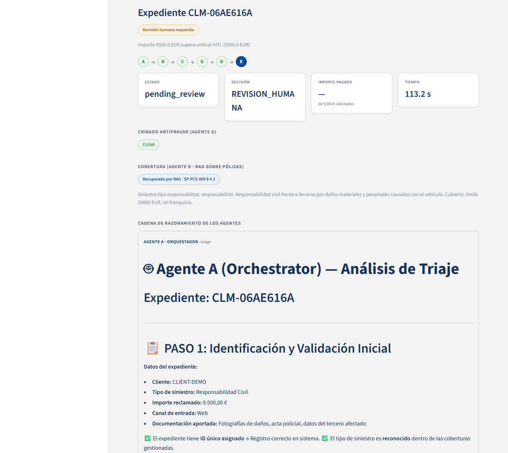

*Figura 3.4. Escenario «Revisión humana (HITL)»: los seis agentes se ejecutan, pero el Agente E deriva el expediente (estado `pending_review`) porque 9.500 € supera el umbral de 5.000 €.*

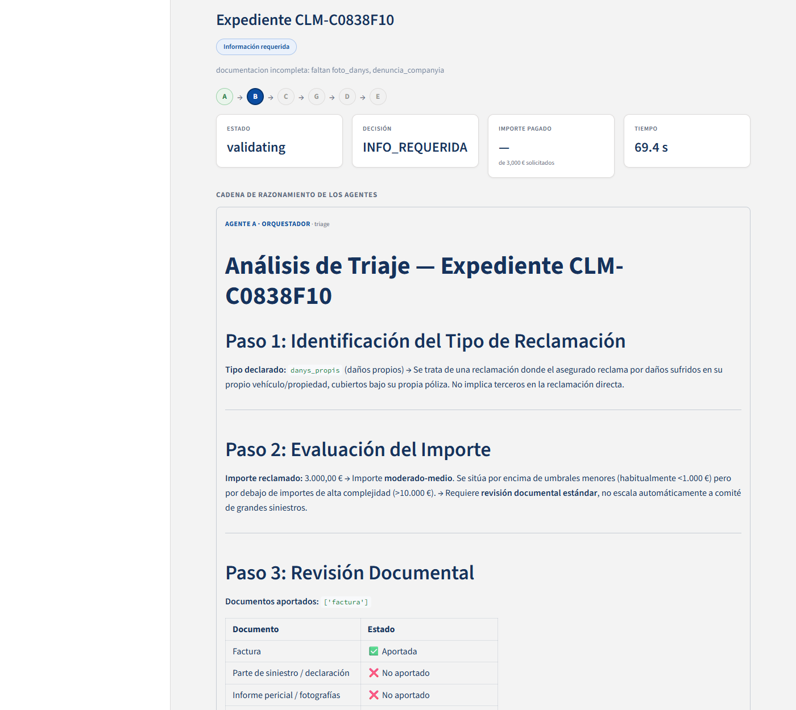

*Figura 3.5. Escenario «Información requerida»: el flujo se detiene en el Agente B (solo A y B en el stepper) y el motivo enumera los documentos que faltan.*

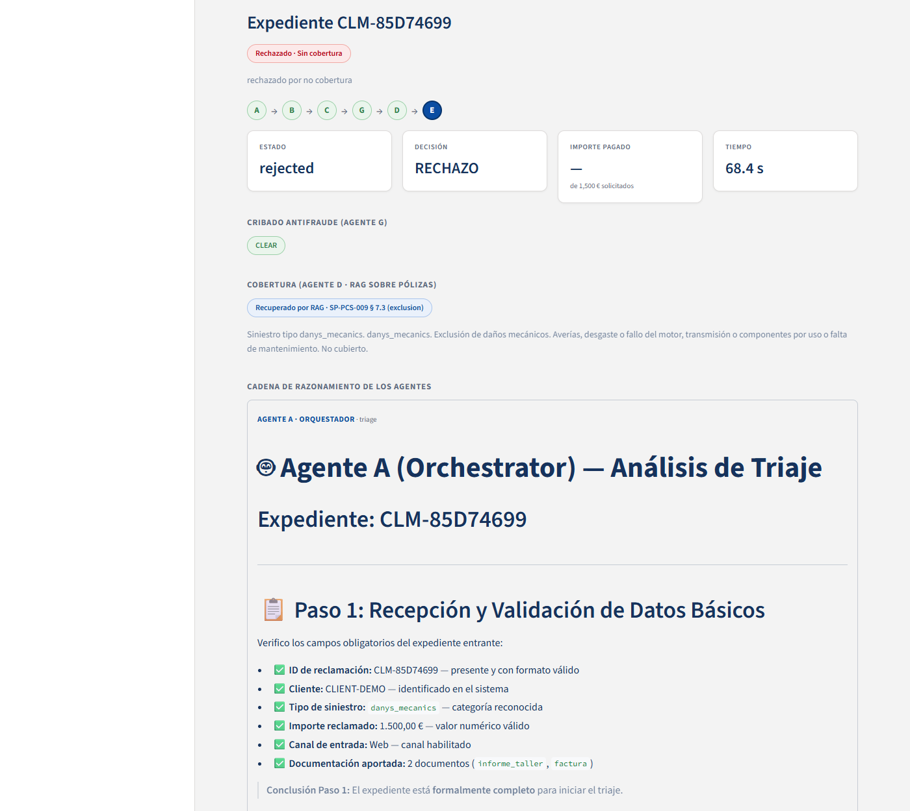

*Figura 3.6. Escenario «Rechazo por no cobertura»: el Agente D identifica la exclusión § 7.3 de la póliza sintética y el flujo termina sin pasar por el Agente E.*

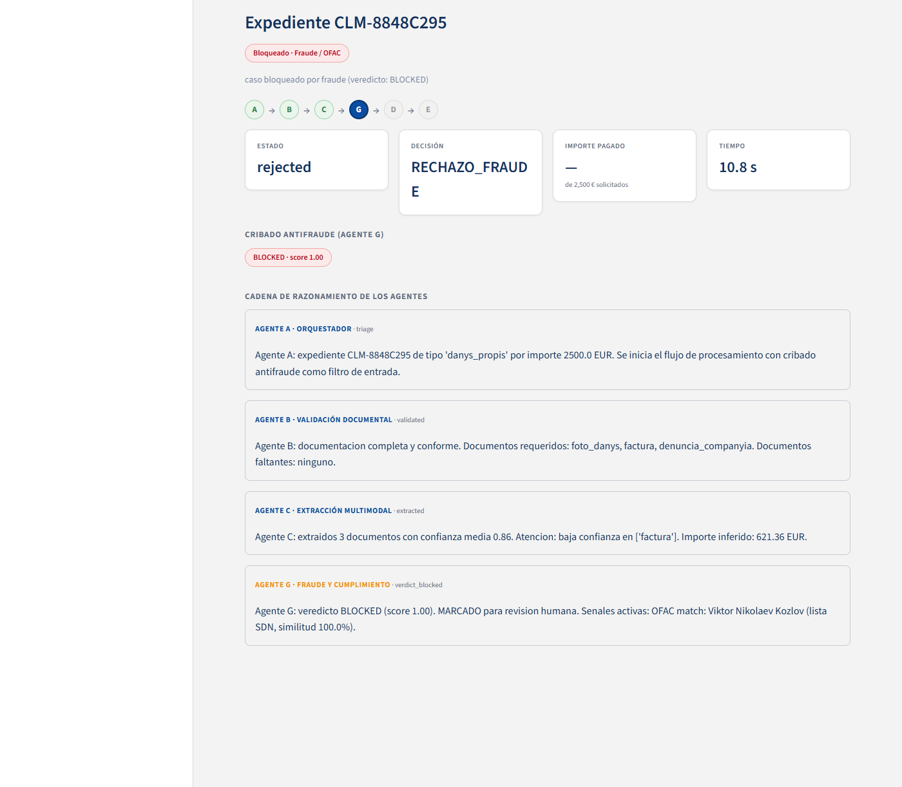

*Figura 3.7. Escenario «Bloqueo por fraude (OFAC)»: el Agente G devuelve `BLOCKED` con puntuación 1.0 por coincidencia del nombre con la lista de sanciones sintética; los Agentes D y E no llegan a ejecutarse.*

### 5.7 Vista Bandeja

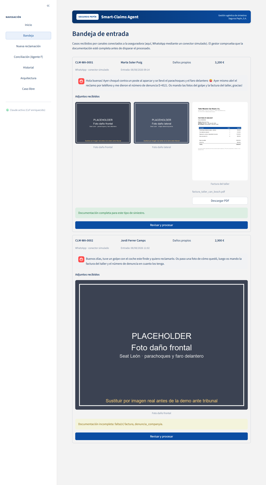

*Figura 3.8. Bandeja de entrada simulada: dos siniestros recibidos por WhatsApp con su mensaje, adjuntos (fotos y factura PDF con miniatura) y el semáforo de documentación.*

La Bandeja simula la recepción de siniestros por un canal conversacional (WhatsApp). Cada tarjeta muestra el identificador del ticket, el asegurado, la fecha de entrada, el tipo, el importe, el mensaje literal del cliente, los **adjuntos reales** (imágenes en `assets/demo/`, y la factura PDF con miniatura y botón `Descargar PDF`) y un aviso de completitud documental:

| Ticket | Asegurado | Tipo / importe | Adjuntos | Documentación | Resultado esperado |
|---|---|---|---|---|---|
| `CLM-WA-0001` | Marta Soler Puig (`CLIENT-BANDEJA-01`) | Daños propios · 3.200 € | Foto frontal, foto lateral, `factura_taller_can_bosch.pdf` | Completa (incluye denuncia D-4521) | `PAGO` · 2.900 € (3.200 − 300) |
| `CLM-WA-0002` | Jordi Ferrer Camps | Daños propios · 2.900 € | Solo foto de daños | Incompleta: falta(n) `factura`, `denuncia_companyia` | `INFO_REQUERIDA` |

El botón `Revisar y procesar` lanza el expediente **con los adjuntos como ficheros subidos**, por lo que, con clave de Anthropic, el Agente C realiza extracción real sobre las dos fotos y el PDF. El resultado se muestra **dentro de la propia tarjeta** del ticket procesado, para que la narración de la demo quede junto al mensaje que la originó.

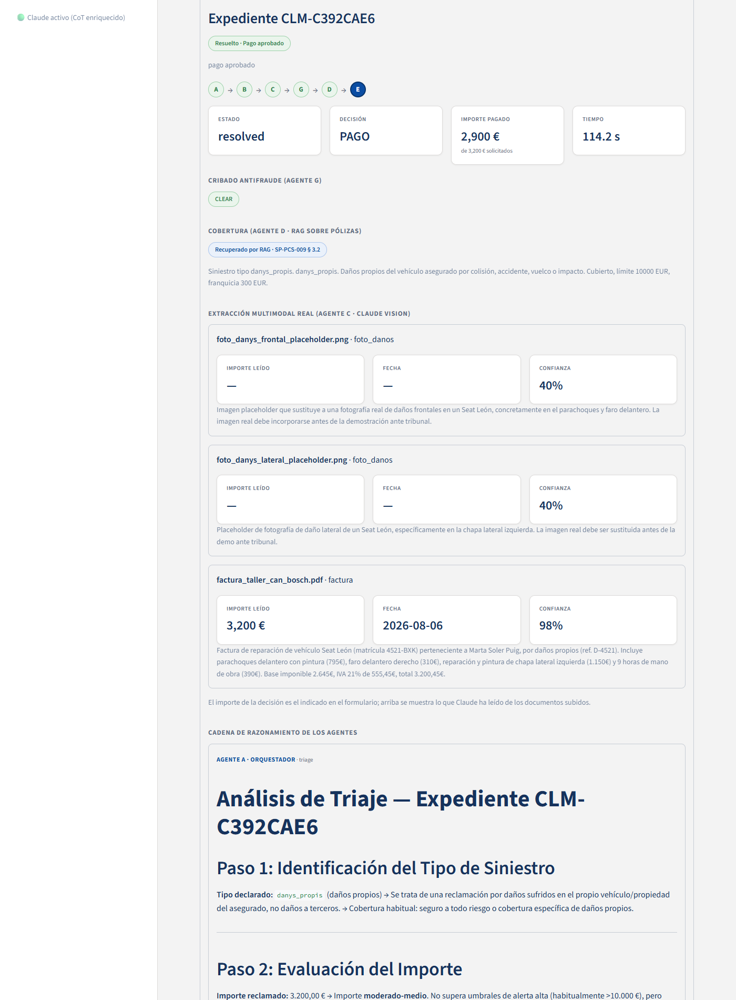

*Figura 3.9. Resultado de `CLM-WA-0001` procesado desde la Bandeja (`PAGO` · 2.900 € de 3.200 €): además de las secciones habituales, aparece «Extracción multimodal real (Agente C · Claude Vision)» con una tarjeta por adjunto. Claude lee de la factura del taller el importe (3.200 €), la fecha (2026-08-06) y una confianza del 98 %, y describe su contenido (matrícula, conceptos, base imponible e IVA); en las dos fotografías, que en los fixtures son imágenes *placeholder*, no encuentra importe ni fecha y asigna una confianza del 40 %, por debajo del umbral de 0,85 (§7.5), lo que las marca como de baja confianza. La decisión se toma sobre el importe declarado en el ticket, como indica la nota al pie de la sección.*

### 5.8 Vista Conciliación (Agente F)

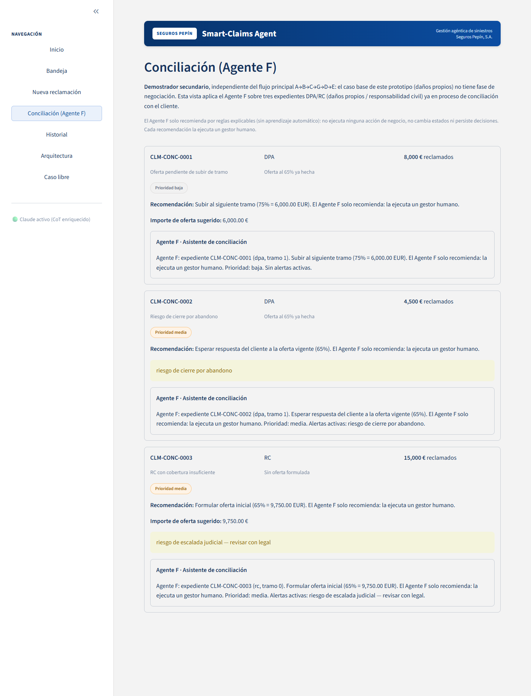

*Figura 3.10. Demostrador del Agente F sobre tres expedientes en negociación: prioridad, recomendación, importe de oferta sugerido, alertas y razonamiento por reglas.*

El Agente F (asesor de conciliación) **no forma parte del grafo A→B→C→G→D→E**: es un módulo independiente que recomienda el siguiente paso en negociaciones de daños propios (DPA) y responsabilidad civil (RC) tras un primer rechazo de oferta. Funciona **solo por reglas explicables**, sin LLM ni aprendizaje automático, y **nunca ejecuta** la acción: la recomendación la aplica un gestor humano.

Reglas que aplica (constantes de `backend/app/agents/conciliation_advisor.py`):

| Situación | Recomendación | Importe de oferta |
|---|---|---|
| Sin oferta previa (tramo 0) | Formular oferta inicial | 65 % del importe reclamado |
| Oferta del tramo 1 o 2 rechazada | Subir al siguiente tramo | 75 % (tras el tramo 1) · 90 % (tras el tramo 2) |
| Oferta del tramo 3 (90 %) rechazada | Decisión humana requerida: transar una última vez, cierre por abandono o derivación a vía judicial; el Agente F no elige entre las tres | — |
| Oferta vigente, sin respuesta del cliente | Esperar respuesta del cliente a la oferta vigente | — |

Alertas que puede emitir: *riesgo de cierre por abandono* (más de 30 días sin respuesta del cliente), *expediente estancado — priorizar* (más de 45 días en el tramo de negociación actual) y *riesgo de escalada judicial — revisar con legal* (expediente de RC cuya cobertura es insuficiente frente a la reclamación). La prioridad se deriva del número de alertas: **alta** (2 o más), **media** (1), **baja** (0). Cada recomendación termina con la nota «El Agente F solo recomienda: la ejecuta un gestor humano.»

Los tres expedientes de demostración (`streamlit_conciliation_fixtures.py`):

| Expediente | Tipo / importe | Situación | Recomendación mostrada |
|---|---|---|---|
| `CLM-CONC-0001` | DPA · 8.000 € | Oferta del tramo 1 rechazada | Subir al siguiente tramo (75 % = 6.000,00 €) |
| `CLM-CONC-0002` | DPA · 4.500 € | Oferta del tramo 1 sin respuesta desde hace 40 días | Esperar respuesta; alerta de abandono; prioridad media |
| `CLM-CONC-0003` | RC · 15.000 € | Sin oferta previa; cobertura insuficiente | Formular oferta inicial (65 % = 9.750,00 €); alerta de escalada judicial |

### 5.9 Vista Historial

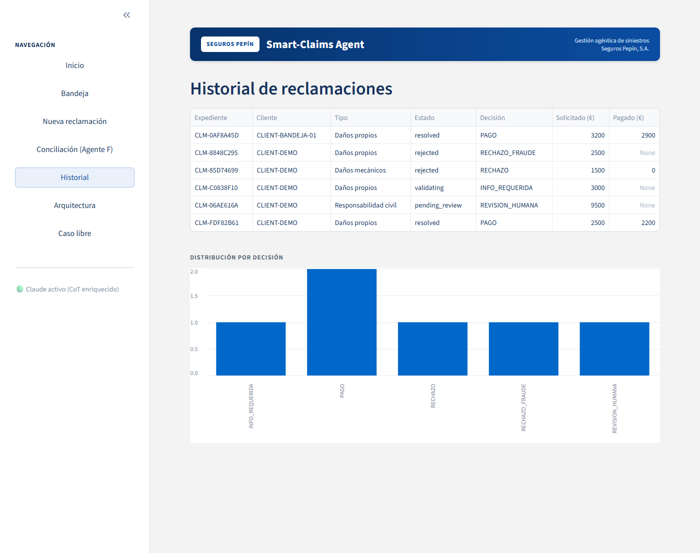

*Figura 3.11. Historial de la sesión tras procesar los cinco escenarios y un ticket de la Bandeja: tabla de expedientes y distribución por decisión.*

Tabla con los expedientes procesados **en la sesión actual del navegador** (columnas `Expediente`, `Cliente`, `Tipo`, `Estado`, `Decisión`, `Solicitado (€)`, `Pagado (€)`) y gráfico de barras con el recuento por decisión. Al recargar la página, la sesión de Streamlit se reinicia y el historial se vacía; la persistencia duradera corresponde a MariaDB (§8), disponible solo en el Modo 1.

### 5.10 Vista Arquitectura

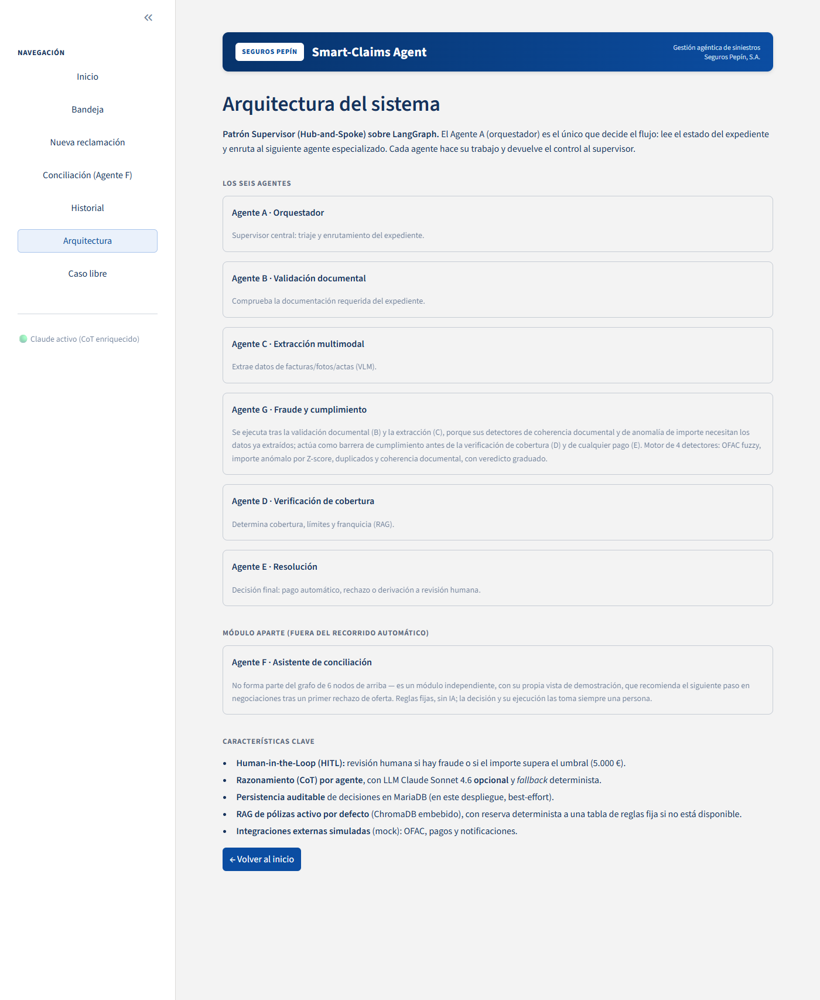

*Figura 3.12. Vista Arquitectura: patrón Supervisor (Hub-and-Spoke) sobre LangGraph, los seis agentes en orden de ejecución, el Agente F como módulo aparte y las características clave.*

Vista informativa para el tribunal: describe el patrón Supervisor, los seis agentes en su orden de ejecución (A, B, C, G, D, E) con la justificación de por qué el Agente G se ejecuta tras la extracción (sus detectores de coherencia documental y de anomalía de importe necesitan los datos ya extraídos) y antes de cobertura y pago, el Agente F como módulo independiente, y las características clave (HITL, CoT opcional, persistencia auditable, RAG activo por defecto, integraciones simuladas).

### 5.11 Vista Caso libre y blindaje de entrada

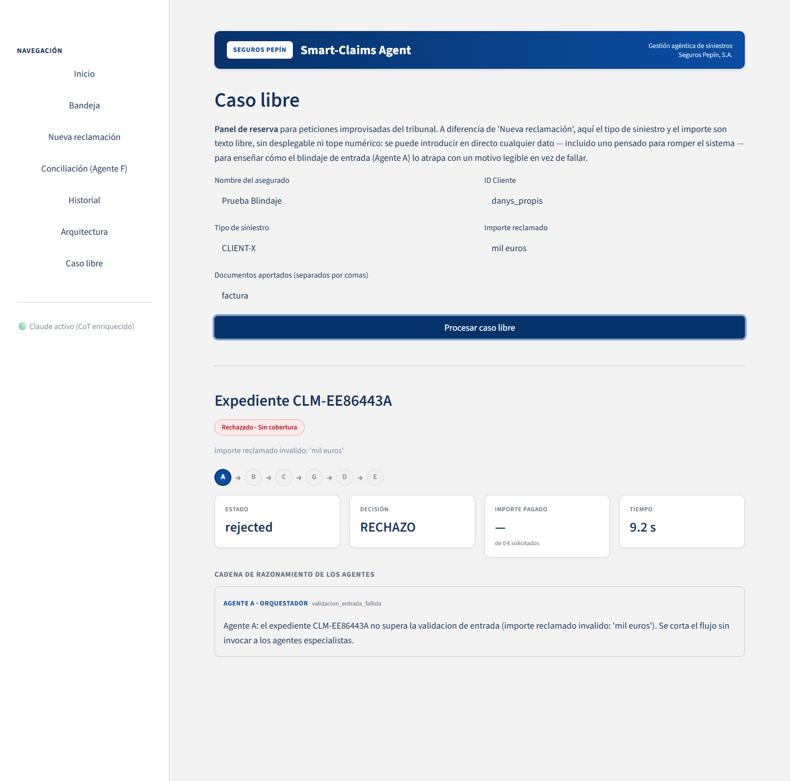

*Figura 3.13. Caso libre con el importe «mil euros» (no numérico): el blindaje A1 del Agente A rechaza el expediente con un motivo legible en lugar de fallar.*

*Caso libre* es el **panel de reserva** para peticiones improvisadas del tribunal. A diferencia de *Nueva reclamación*, sus cinco campos son de **texto libre**, sin desplegables ni topes numéricos: nombre del asegurado, ID Cliente, tipo de siniestro, importe reclamado y documentos (separados por comas). Sirve para introducir en directo cualquier dato — incluido uno pensado para romper el sistema — y mostrar que el blindaje de entrada lo captura con un motivo legible.

El blindaje se compone de cinco piezas:

| Pieza | Dónde | Qué hace | Qué se ve en pantalla |
|---|---|---|---|
| **A1** — validación de entrada | `validate_claim_input` (Agente A) | Rechaza importes no numéricos, no finitos, ≤ 0 o ≥ 10.000.000 €; deriva a revisión humana tipos de siniestro no reconocidos y nombres vacíos o de más de 200 caracteres; elimina documentos duplicados | `RECHAZO` con motivo `importe reclamado invalido: 'mil euros'`; `REVISION_HUMANA` con motivo `tipo de siniestro no reconocido: ...` o `nombre del asegurado invalido (vacio o excesivamente largo)` |
| **A2** — captura global de errores | `process_claim` (orquestador) | Cualquier excepción interna no prevista se convierte en `REVISION_HUMANA` con motivo `error_interno_controlado` | Resultado normal con estado `pending_review`; nunca un traceback |
| **A3** — sin trazas en la interfaz | `streamlit_app.py` | Si aun así algo falla al procesar, la app muestra un mensaje breve y registra el incidente en el log del servidor | *«No se pudo procesar la reclamación. Se ha registrado el incidente.»* |
| **A4** — validación en el formulario | Vista Nueva reclamación | El desplegable solo ofrece los cuatro tipos válidos y el importe está acotado a 0–100.000 € | Aviso si faltan tipo o importe |
| **A5** — panel Caso libre | Vista Caso libre | Permite alcanzar desde la interfaz las ramas de A1 que el formulario acotado impide | Cualquier motivo de A1 |

> Un tipo de siniestro desconocido (por ejemplo `inundacion`) no se rechaza: se deriva a un gestor (`REVISION_HUMANA`), ya que puede tratarse de un tipo real no contemplado por el catálogo sintético.

---

## 6. Modo 3 — CLI de demostración, API REST y evaluador

### 6.1 CLI de demostración

La CLI ejecuta cuatro expedientes predefinidos directamente sobre el orquestador Python y muestra el Chain of Thought y la decisión en la terminal. No requiere Docker, MariaDB ni ChromaDB.

#### Instalación de dependencias (una sola vez)

```powershell
# Windows — desde la raíz del repositorio
py -m pip install -r backend/requirements.txt
```

```bash
# Linux / macOS
python3.11 -m pip install -r backend/requirements.txt
```

#### Ejecución

```powershell
# Windows — desde la raíz del repositorio
py backend/scripts/run_demo.py
```

```bash
# Linux / macOS
python3.11 backend/scripts/run_demo.py
```

O desde el contenedor del backend (si Docker está levantado):

```bash
docker exec -it sca-backend python scripts/run_demo.py
```

#### Casos de demostración

El script ejecuta cuatro expedientes con una semilla aleatoria fija (`random.seed(7)`) para garantizar reproducibilidad:

| Expediente | `claim_type` | Importe | Documentos | Decisión esperada |
|---|---|---|---|---|
| `DEMO-PAGO` | `danys_propis` | 3.200 € | Completos | `PAGO` |
| `DEMO-HITL` | `responsabilitat` | 8.500 € | Completos | `REVISION_HUMANA` |
| `DEMO-RECHAZO` | `danys_mecanics` | 1.000 € | Completos | `RECHAZO` |
| `DEMO-INFO` | `danys_propis` | 1.000 € | Solo `factura` | `INFO_REQUERIDA` |

> El camino `RECHAZO_FRAUDE` no está en la CLI: se demuestra desde la app Streamlit (escenario OFAC, §5.4.1), porque depende del nombre del asegurado.

#### Ejemplo de salida

```
------------------------------------------------------------------------------
  Expediente: DEMO-PAGO
  Escenario:  Pago automatico (cobertura + importe bajo)
  Tipo:       danys_propis  |  Importe: 3200.0 EUR
------------------------------------------------------------------------------

  Razonamiento (Chain of Thought):
    1. Agente A: expediente DEMO-PAGO de tipo 'danys_propis' por importe 3200.0 EUR. Se inicia el flujo de procesamiento con cribado antifraude como filtro de entrada.
    2. Agente B: documentacion completa y conforme. Documentos requeridos: foto_danys, factura, denuncia_companyia. Documentos faltantes: ninguno.
    3. Agente C: extraidos 3 documentos con confianza media 0.83. Atencion: baja confianza en ['foto_danys', 'factura', 'denuncia_companyia']. Importe inferido: 4305.77 EUR.
    4. Agente G: veredicto CLEAR (score 0.00). Sin indicios relevantes. Senales activas: Sin senales de fraude detectadas.
    5. Agente D: cobertura según el catálogo de pólizas. Siniestro 'danys_propis' cubierto segun seccion SP-PCS-009 § 3.2. Importe neto pagable: 2900.00 EUR (limite 10000 EUR, franquicia 300 EUR).
    6. Agente E: cobertura confirmada (seccion SP-PCS-009 § 3.2) e importe 2900.00 EUR dentro del umbral. Se aprueba el PAGO automatico.

  >>> Decision:  PAGO
      Estado:    resolved
      HITL:      False
      Importe pagado: 2900.0 EUR
```

Salida real del script en modo fallback (sin clave). El importe pagado (2.900 €) corresponde a los 3.200 € reclamados menos la franquicia de 300 € de la póliza de daños propios. Sin ficheros adjuntos, el Agente C simula la extracción (confianza e «importe inferido» generados con la semilla fija), lo que explica el aviso de baja confianza; ese importe inferido no interviene en la decisión.

### 6.2 API REST

Con el backend levantado (Docker o ejecución local), la API REST acepta peticiones en `http://localhost:8000`.

#### Endpoints disponibles

| Método | Endpoint | Descripción |
|---|---|---|
| `GET` | `/health` | Estado del servicio (`{"status":"ok","version":"0.5.0"}`) |
| `GET` | `/api/v1/agents/status` | Estado y descripción de los seis agentes |
| `POST` | `/api/v1/claims/` | Procesa un expediente → decisión + CoT + HITL |
| `GET` | `/api/v1/claims/` | Lista expedientes (paginación y filtro por estado) |
| `GET` | `/api/v1/claims/{claim_id}` | Detalle de un expediente con todas sus decisiones |
| `GET` | `/api/v1/claims/{claim_id}/trace` | Solo el Chain of Thought de un expediente |

La documentación Swagger interactiva está en `http://localhost:8000/docs`. El cuerpo del `POST` admite `claim_id` (opcional; si se omite, el backend genera uno), `client_id`, `client_email`, `claim_type`, `channel`, `amount_requested`, `documents` y `text`. El nombre del asegurado y los ficheros adjuntos solo se pueden aportar desde la app Streamlit.

#### Ejemplo 1: PAGO (daños propios, importe bajo, docs completos)

```bash
curl -s -X POST http://localhost:8000/api/v1/claims/ \
  -H "Content-Type: application/json" \
  -d '{
    "claim_id": "CLM-PAGO-01",
    "client_id": "C-A",
    "claim_type": "danys_propis",
    "channel": "email",
    "amount_requested": 3200.0,
    "documents": ["foto_danys", "factura", "denuncia_companyia"]
  }'
```

Respuesta esperada (resumen):

```json
{
  "claim_id": "CLM-PAGO-01",
  "status": "resolved",
  "decision": "PAGO",
  "amount_paid": 2900.0,
  "hitl_required": false
}
```

#### Ejemplo 2: REVISION_HUMANA (importe supera el umbral HITL)

```bash
curl -s -X POST http://localhost:8000/api/v1/claims/ \
  -H "Content-Type: application/json" \
  -d '{
    "claim_id": "CLM-HITL-01",
    "client_id": "C-B",
    "claim_type": "responsabilitat",
    "channel": "web",
    "amount_requested": 8500.0,
    "documents": ["foto_danys", "acta_policial", "dades_tercer"]
  }'
```

Respuesta esperada (resumen):

```json
{
  "claim_id": "CLM-HITL-01",
  "status": "pending_review",
  "decision": "REVISION_HUMANA",
  "amount_paid": null,
  "hitl_required": true,
  "termination_reason": "importe 8500.0 EUR supera umbral HITL (5000.0 EUR)"
}
```

#### Ejemplo 3: RECHAZO (tipo sin cobertura)

```bash
curl -s -X POST http://localhost:8000/api/v1/claims/ \
  -H "Content-Type: application/json" \
  -d '{
    "claim_id": "CLM-RECH-01",
    "client_id": "C-C",
    "claim_type": "danys_mecanics",
    "channel": "email",
    "amount_requested": 1000.0,
    "documents": ["informe_taller", "factura"]
  }'
```

Respuesta esperada (resumen):

```json
{
  "claim_id": "CLM-RECH-01",
  "status": "rejected",
  "decision": "RECHAZO",
  "hitl_required": false,
  "termination_reason": "rechazado por no cobertura"
}
```

#### Ejemplo 4: INFO_REQUERIDA (documentación incompleta)

```bash
curl -s -X POST http://localhost:8000/api/v1/claims/ \
  -H "Content-Type: application/json" \
  -d '{
    "claim_id": "CLM-INFO-01",
    "client_id": "C-D",
    "claim_type": "danys_propis",
    "channel": "email",
    "amount_requested": 1000.0,
    "documents": ["factura"]
  }'
```

Respuesta esperada (resumen):

```json
{
  "claim_id": "CLM-INFO-01",
  "status": "validating",
  "decision": "INFO_REQUERIDA",
  "hitl_required": false,
  "termination_reason": "documentacion incompleta: faltan foto_danys, denuncia_companyia"
}
```

#### Ejemplo 5: importe anómalo (MEDIUM_RISK, sin bloqueo)

La API no admite el nombre del asegurado, por lo que el bloqueo `RECHAZO_FRAUDE` por lista de sanciones solo se demuestra desde la app Streamlit (§5.4.1). Sí puede observarse el detector de importe anómalo: un importe por encima del máximo histórico del tipo (9.000 € para `danys_propis`) suma +0,40 al riesgo, lo que produce el veredicto `MEDIUM_RISK` sin bloquear el expediente, que continúa hasta el Agente E y termina en revisión humana por importe:

```bash
curl -s -X POST http://localhost:8000/api/v1/claims/ \
  -H "Content-Type: application/json" \
  -d '{
    "claim_id": "CLM-ANOM-01",
    "client_id": "C-Z",
    "claim_type": "danys_propis",
    "channel": "email",
    "amount_requested": 9800.0,
    "documents": ["foto_danys", "factura", "denuncia_companyia"]
  }'
```

Respuesta esperada (resumen):

```json
{
  "claim_id": "CLM-ANOM-01",
  "status": "pending_review",
  "decision": "REVISION_HUMANA",
  "hitl_required": true,
  "termination_reason": "importe 9500.0 EUR supera umbral HITL (5000.0 EUR)"
}
```

En la traza (`GET /api/v1/claims/CLM-ANOM-01/trace`), la entrada del Agente G indica `veredicto MEDIUM_RISK (score 0.40)` con la señal de importe anómalo (z-score 5,0; máximo histórico superado).

#### Consultar un expediente ya procesado

```bash
curl -s http://localhost:8000/api/v1/claims/CLM-PAGO-01
```

Si el expediente no existe en la base de datos, la respuesta es `HTTP 404`.

### 6.3 Evaluador in-process y tests automáticos

Para reproducir las métricas del capítulo 4 sin backend ni base de datos, el evaluador ejecuta los 32 casos del dataset sintético directamente sobre el orquestador (retira la clave de Anthropic del entorno para que el resultado sea determinista) y escribe `data/synthetic/evaluation_inprocess.json`:

```powershell
# Windows — desde la carpeta backend/
cd backend
py scripts/evaluate_inprocess.py
```

La batería de pruebas automáticas (102 tests: unitarios por agente, orquestación, blindaje, Agente F, fixtures de la app y contrato de la interfaz) se ejecuta con:

```powershell
cd backend
py -m pytest tests -q
```

Los tests no requieren clave de Anthropic ni servicios externos.

---

## 7. Interpretación de resultados

### 7.1 Decisiones posibles

| `decision` | `status` | Píldora en la app | Significado | Agente que la produce |
|---|---|---|---|---|
| `PAGO` | `resolved` | Resuelto · Pago aprobado | Cobertura confirmada, sin fraude, importe neto dentro del umbral; pago simulado al IBAN de prueba | E |
| `REVISION_HUMANA` | `pending_review` | Revisión humana requerida | Importe neto superior al umbral HITL, veredicto `HIGH_RISK` del Agente G, tipo no reconocido, nombre inválido o error interno controlado | E, G (o A en el blindaje) |
| `INFO_REQUERIDA` | `validating` | Información requerida | Faltan documentos obligatorios; se simula una solicitud al cliente | B |
| `RECHAZO` | `rejected` | Rechazado · Sin cobertura | Tipo excluido de la póliza, o importe inválido (blindaje A1) | D (o A en el blindaje) |
| `RECHAZO_FRAUDE` | `rejected` | Bloqueado · Fraude / OFAC | Veredicto `BLOCKED` del Agente G (coincidencia confirmada con la lista de sanciones); el expediente pasa a compliance | G |

### 7.2 Human-in-the-Loop (HITL) y el campo `hitl_required`

El Agente E deriva a revisión humana cuando el **importe neto a pagar** (importe reclamado, limitado al máximo de la póliza, menos la franquicia) es **estrictamente superior** al umbral `HITL_AMOUNT_THRESHOLD` (5.000 € por defecto). Un importe neto de exactamente 5.000 € se paga automáticamente. Ejemplos con el umbral por defecto:

| Tipo | Importe reclamado | Importe neto | Decisión |
|---|---|---|---|
| `danys_propis` | 5.300 € | 5.000 € | `PAGO` |
| `danys_propis` | 5.400 € | 5.100 € | `REVISION_HUMANA` |
| `responsabilitat` | 5.000 € | 5.000 € | `PAGO` |
| `responsabilitat` | 5.001 € | 5.001 € | `REVISION_HUMANA` |

El campo `hitl_required` es `true` en toda `REVISION_HUMANA`, tanto la que deriva el Agente E por importe como la que deriva el Agente G con veredicto `HIGH_RISK`: ninguna decisión adversa basada en una puntuación probabilística se toma sin supervisión humana. El único rechazo automático por fraude es `RECHAZO_FRAUDE`, reservado a la coincidencia confirmada con la lista de sanciones (`BLOCKED`); en ese caso la entrada del Agente G en el log de decisiones queda marcada con `hitl_required = true` para que compliance revise el bloqueo. En el prototipo, la derivación termina el flujo; la revisión humana posterior queda fuera del alcance del MVP (la tabla `hitl_feedback` de MariaDB está preparada para registrarla).

### 7.3 Veredicto de fraude (Agente G)

El Agente G ejecuta cuatro detectores deterministas sobre datos sintéticos y combina sus señales en una puntuación de riesgo 0–1:

| Detector | Señal | Umbral / regla | Aportación a la puntuación |
|---|---|---|---|
| Lista de sanciones (OFAC/SDN sintética) | Similitud difusa entre el nombre del asegurado y las 15 entradas de la lista (p. ej. *Viktor Nikolaev Kozlov*, *Amira Belhaj*, *Al-Rashid Trading Group*) | Similitud ≥ 0,82 | Puntuación 1,0 y veredicto `BLOCKED` directo |
| Importe anómalo | Z-score del importe frente al *baseline* del tipo (`danys_propis`: media 2.800 €, desv. 1.400 €, máx. 9.000 €; `responsabilitat`: 12.000 / 8.000 / 48.000; `robatori`: 3.200 / 1.600 / 7.500; `danys_mecanics`: 800 / 400 / 3.000) | \|z\| ≥ 2,0, o importe > máximo histórico | +0,40 si supera el máximo; si no, +min(\|z\|/5, 0,35) |
| Duplicados | Siniestro del mismo cliente y tipo en los últimos 90 días (historial simulado: `C-A` daños propios 20-05-2026, `C-B` RC 15-04-2026, `C-C` robo 10-03-2026) | Ventana de 90 días | +0,35 (×0,65 si el anterior tiene más de 30 días) |
| Coherencia documental | Discrepancias entre lo declarado y lo extraído por el Agente C (importes, fechas, tipo de documento) | Cada incidencia | +0,10 por incidencia, máximo +0,25 |

Veredicto: `BLOCKED` (coincidencia OFAC), `HIGH_RISK` (≥ 0,55), `MEDIUM_RISK` (≥ 0,25) o `CLEAR`. `BLOCKED` bloquea el expediente (`RECHAZO_FRAUDE`, rechazo automático); `HIGH_RISK` corta el flujo antes de D y E y lo deriva a revisión humana obligatoria (`REVISION_HUMANA`, `hitl_required = true`); `MEDIUM_RISK` se registra en el razonamiento y el flujo continúa hacia el Agente D.

> Las fechas del historial simulado son fijas, por lo que la ventana de 90 días depende de la fecha del sistema: pasados 90 días desde esas fechas, el detector de duplicados deja de activarse para `C-A`, `C-B` y `C-C`.

### 7.4 Cobertura RAG (Agente D)

El resultado de cobertura contiene `covered`, `max_amount`, `deductible`, `policy_section`, `source` (`rag` o `mock`), `retrieved_snippet` y `retrieval_distance`. Con `source = "rag"`, la sección y el fragmento proceden de la búsqueda semántica sobre `data/policies/`; con `source = "mock"`, del catálogo determinista de `check_policy` (tabla de §5.4.3). En ambos casos el importe neto se calcula como `max(0, min(importe, máximo) − franquicia)`.

### 7.5 Extracción multimodal (Agente C · Claude Vision)

- **Con ficheros subidos y clave de Anthropic:** cada fichero (imagen o PDF) se envía a `claude-sonnet-4-6` con una instrucción de extracción estructurada; el resultado tiene `doc_type`, `amount`, `date`, `vendor`, `summary` y `confidence`, y la fuente es `claude_vision`. Una confianza inferior a 0,85 se marca como baja en el razonamiento.
- **Con ficheros subidos pero sin clave:** el documento aparece como `desconocido` con el resumen *«Extracción no disponible (sin clave LLM o error).»* y confianza 0; el flujo continúa.
- **Sin ficheros:** el Agente C simula la extracción a partir de los tipos de documento declarados (fuente `mock`).

El importe que decide el expediente es siempre el **declarado** en el formulario; el importe leído por Vision se usa para el detector de coherencia del Agente G y se muestra a título informativo.

### 7.6 Chain of Thought (`reasoning_trace` / `decisions_log`)

Cada agente añade una entrada a `decisions_log` (agente, acción, razonamiento, confianza, `hitl_required`) y una línea a `reasoning_trace`. En la app, la sección «Cadena de razonamiento de los agentes» muestra `decisions_log` como una línea de tiempo; en la API, `GET /api/v1/claims/{id}/trace` devuelve la misma información. Con clave, el texto lo redacta Claude a partir de los datos deterministas del agente; sin clave, es una plantilla de fallback con los mismos datos.

---

## 8. Inspección de la base de datos con Adminer

### 8.1 Acceso a Adminer

Con el sistema Docker levantado, abrir en el navegador:

```
http://localhost:8082
```

Introducir los siguientes datos de conexión:

| Campo | Valor |
|---|---|
| Sistema | MariaDB |
| Servidor | `mariadb` |
| Usuario | `claims_user` |
| Contraseña | `claims_s3cret_dev` (o el valor configurado en `.env`) |
| Base de datos | `smart_claims` |

### 8.2 Tablas del esquema

La base de datos `smart_claims` contiene tres tablas:

| Tabla | Descripción |
|---|---|
| `claims` | Un registro por expediente. Columnas principales: `id`, `client_id`, `claim_type`, `channel`, `status`, `amount_requested`, `amount_approved`, `created_at`. |
| `agent_decisions` | Una fila por decisión de cada agente. Columnas: `claim_id` (FK), `agent`, `action`, `reasoning` (texto completo del CoT), `confidence`, `hitl_required`, `created_at`. |
| `hitl_feedback` | Preparada para registrar el feedback del operador humano en casos HITL. Columnas: `claim_id`, `decision_id` (FK), `reviewer`, `original_action`, `final_action`, `override_reason`. En el MVP actual está vacía; se alimentará en fases posteriores. |

### 8.3 Consultas SQL útiles

**Traza completa de decisiones de un expediente:**

```sql
SELECT
    ad.created_at,
    ad.agent,
    ad.action,
    ad.reasoning,
    ad.confidence,
    ad.hitl_required
FROM agent_decisions ad
WHERE ad.claim_id = 'CLM-PAGO-01'
ORDER BY ad.id ASC;
```

**Estado final de un expediente:**

```sql
SELECT id, claim_type, status, amount_requested, amount_approved, created_at
FROM claims
WHERE id = 'CLM-PAGO-01';
```

**Resumen de expedientes por estado:**

```sql
SELECT status, COUNT(*) AS total
FROM claims
GROUP BY status
ORDER BY total DESC;
```

---

## 9. Resolución de problemas frecuentes

### 9.1 Sin `ANTHROPIC_API_KEY` — el sistema usa el fallback determinista

**Síntoma:** el razonamiento en «Cadena de razonamiento» es breve y esquemático; en la barra lateral aparece `⚪ Modo fallback determinista (sin clave)`; en la Bandeja, los adjuntos se muestran como `desconocido` con «Extracción no disponible».

**Causa:** la variable `ANTHROPIC_API_KEY` no está configurada o es inválida.

**Solución:** añadir una clave válida de Anthropic en `.env` y reiniciar (`docker compose restart backend` en el Modo 1; relanzar `streamlit run` en el Modo 2). En Streamlit Cloud, añadir la clave en la sección *Secrets* del panel de administración y reiniciar la app.

El comportamiento de la demo es correcto en cualquier caso; el fallback es un comportamiento previsto del diseño.

### 9.2 Sin MariaDB — la CLI y la app muestran un aviso en el log pero continúan

**Síntoma (CLI o consola de Streamlit):** aparece una línea de log similar a:

```
WARNING root: No se han podido persistir las decisiones de DEMO-PAGO: ...
```

**Causa:** se ejecuta sin el servicio MariaDB levantado. `process_claim` captura la excepción y continúa el flujo sin interrupciones; en la app, el usuario no ve ningún error.

**Solución:** este comportamiento es intencional. Para persistencia completa, usar el despliegue Docker (§4).

### 9.3 El Agente D muestra `source = "mock"` (sin sección RAG en el resultado)

**Síntoma:** en el resultado no aparece la sección «Cobertura (Agente D · RAG sobre pólizas)».

**Causa:** `SCA_RAG_ENABLED` está vacío o a `0`, o la colección embebida no pudo indexarse (por ejemplo, falta la carpeta `data/policies/`). El Agente D cae automáticamente al catálogo determinista.

**Solución:** comprobar `SCA_RAG_ENABLED=1` y que `data/policies/` contiene los cuatro ficheros `SP-PCS-009-*.md`. La decisión es la misma en ambos modos; solo cambia el origen de la sección de póliza citada.

### 9.4 Puerto ocupado al arrancar Docker o Streamlit

**Síntoma (Docker):**

```
Error response from daemon: Ports are not available: exposing port TCP 0.0.0.0:8000 -> ...
```

**Síntoma (Streamlit):** `Port 8501 is already in use`.

**Causa:** uno de los puertos requeridos (8000, 8080, 8082, 3306 o 8501) está en uso, a menudo por otra instancia de la propia app.

**Solución en Windows:**

```powershell
netstat -ano | findstr :8501
taskkill /PID <PID> /F
```

Alternativamente, cambiar el puerto (`streamlit run streamlit_app.py --server.port 8600`) o el mapeo en `docker-compose.yml` (columna izquierda del par `host:contenedor`).

### 9.5 El backend no arranca (`sca-backend` en estado `restarting`)

**Causa más frecuente:** MariaDB no ha completado su inicialización cuando el backend intenta conectarse. El `docker-compose.yml` ya define la condición `service_healthy` para el healthcheck de MariaDB, pero en equipos lentos puede necesitar más tiempo.

**Solución:** esperar entre 30 y 60 segundos y verificar:

```bash
docker compose ps
docker compose logs backend --tail=30
```

Si el problema persiste, comprobar que los valores `DB_*` en `.env` coinciden con los definidos en el bloque `mariadb` de `docker-compose.yml`.

### 9.6 `docker compose up` no levanta ningún frontend en el puerto 8501

**Causa:** el servicio `frontend` está comentado en `docker-compose.yml` desde agosto de 2026 (§4.2); el dashboard vigente es `streamlit_app.py`.

**Solución:** lanzar la app por separado con `py -m streamlit run streamlit_app.py` (§5.1). No es necesario descomentar el bloque.

### 9.7 Error `404 Not Found` al consultar `GET /api/v1/claims/{id}`

**Causa:** el expediente no existe en la base de datos. Esto ocurre cuando se usa la CLI o la app Streamlit sin MariaDB disponible, o cuando el `claim_id` de la consulta no coincide con el que usó `process_claim`.

**Solución:** enviar primero el expediente con `POST /api/v1/claims/` con el sistema Docker activo, y consultar inmediatamente después con el mismo `claim_id`.

### 9.8 El Agente G bloquea un expediente de prueba que parecía legítimo

**Causa:** el motor antifraude es determinista (§7.3). El bloqueo (`BLOCKED`) se debe casi siempre a que el nombre del asegurado se parece (similitud ≥ 0,82) a una entrada de la lista de sanciones sintética; el veredicto `HIGH_RISK` requiere acumular al menos 0,55 entre importe anómalo (máximo +0,40), duplicado reciente del mismo cliente (+0,35, solo para `C-A`, `C-B` y `C-C` dentro de la ventana de 90 días) e incoherencias documentales (máximo +0,25), y no bloquea: deriva el expediente a `REVISION_HUMANA`. Un importe anómalo por sí solo da `MEDIUM_RISK` (0,40), que ni bloquea ni corta el flujo.

**Solución:** la sección «Cribado antifraude» del resultado enumera las señales activadas. Para una prueba limpia, usar un nombre corriente, un ID distinto de `C-A`/`C-B`/`C-C` y un importe dentro del rango habitual del tipo.

### 9.9 El resultado desaparece al cambiar de vista

**Causa:** comportamiento deliberado (§5.2): la navegación descarta `last_result` para que no se muestre un expediente antiguo en otra vista.

**Solución:** consultar el expediente en *Historial*, o volver a procesarlo.

### 9.10 El formulario no admite importes superiores a 100.000 € ni tipos fuera del desplegable

**Causa:** el formulario de *Nueva reclamación* acota deliberadamente las entradas (blindaje A4, §5.11).

**Solución:** usar la vista *Caso libre*, cuyos campos de texto libre permiten cualquier valor y muestran cómo el blindaje A1 lo trata (rechazo por importe inválido, revisión humana por tipo no reconocido, etc.).

### 9.11 `RuntimeError: Event loop is closed` al terminar la CLI

**Síntoma:** la CLI termina con un traceback cosmético:

```
Exception ignored in: <function Connection.__del__ ...>
RuntimeError: Event loop is closed
```

**Causa:** el driver `aiomysql` intenta cerrar sus conexiones después de que el bucle asíncrono se ha cerrado. No afecta al resultado del flujo; es un aviso puramente cosmético.

**Solución:** ignorar el aviso. El script `run_demo.py` ya incluye `await engine.dispose()` al final de `main()` para minimizar este comportamiento.

### 9.12 La barra lateral indica «Claude activo» pero el razonamiento es el del fallback

**Síntoma:** el indicador muestra `🟢 Claude activo (CoT enriquecido)`, pero las tarjetas de razonamiento contienen la línea determinista breve y, en la Bandeja, los adjuntos aparecen con «Extracción no disponible (sin clave LLM o error)» y confianza 0 %. En el log del proceso (`streamlit run` o `docker compose logs backend`) aparecen líneas como:

```
Fallback de razonamiento (LLM no disponible): Error code: 400 - {... 'message': 'Your credit balance is too low to access the Anthropic API. ...'}
Extracción multimodal con Claude falló (factura_taller_can_bosch.pdf): Error code: 400 - {...}
```

**Causa:** el indicador de la barra lateral solo comprueba que `ANTHROPIC_API_KEY` **exista** (`streamlit_app.py`, `has_key = bool(os.getenv("ANTHROPIC_API_KEY"))`); no valida la clave ni el saldo. Si la clave es inválida, ha sido revocada o la cuenta no tiene crédito, cada llamada a la API devuelve un error 4xx y el sistema aplica el fallback previsto (§3.3): la decisión sigue siendo correcta, pero sin CoT enriquecido ni extracción multimodal.

**Solución:** revisar el saldo o la validez de la clave en la consola de Anthropic (*Plans & Billing*), corregirla en `.env` (o en *Secrets*, en Streamlit Cloud) y relanzar la app. Para una demo ante tribunal conviene procesar un expediente de prueba unos minutos antes y comprobar que la cadena de razonamiento muestra el texto extenso de la Figura 3.14.

---

## 10. Referencias

Amershi, S., Weld, D., Vorvoreanu, M., Fourney, A., Nushi, B., Collisson, P., Suh, J., Iqbal, S., Bennett, P. N., Inkpen, K., Teevan, J., Kikin-Gil, R., y Horvitz, E. (2019). Software engineering for machine learning: A case study. *Proceedings of the 41st International Conference on Software Engineering: Software Engineering in Practice*, 291–300. https://doi.org/10.1109/ICSE-SEIP.2019.00042

Anthropic. (2024). *Claude API documentation*. https://docs.anthropic.com

FastAPI. (2024). *FastAPI documentation: Interactive API docs*. https://fastapi.tiangolo.com/features/

LangChain. (2025). *LangGraph documentation*. https://langchain-ai.github.io/langgraph/

Snowflake Inc. (2025). *Streamlit documentation*. https://docs.streamlit.io

Vrána, J. (2024). *Adminer — Database management in a single PHP file*. https://www.adminer.org
